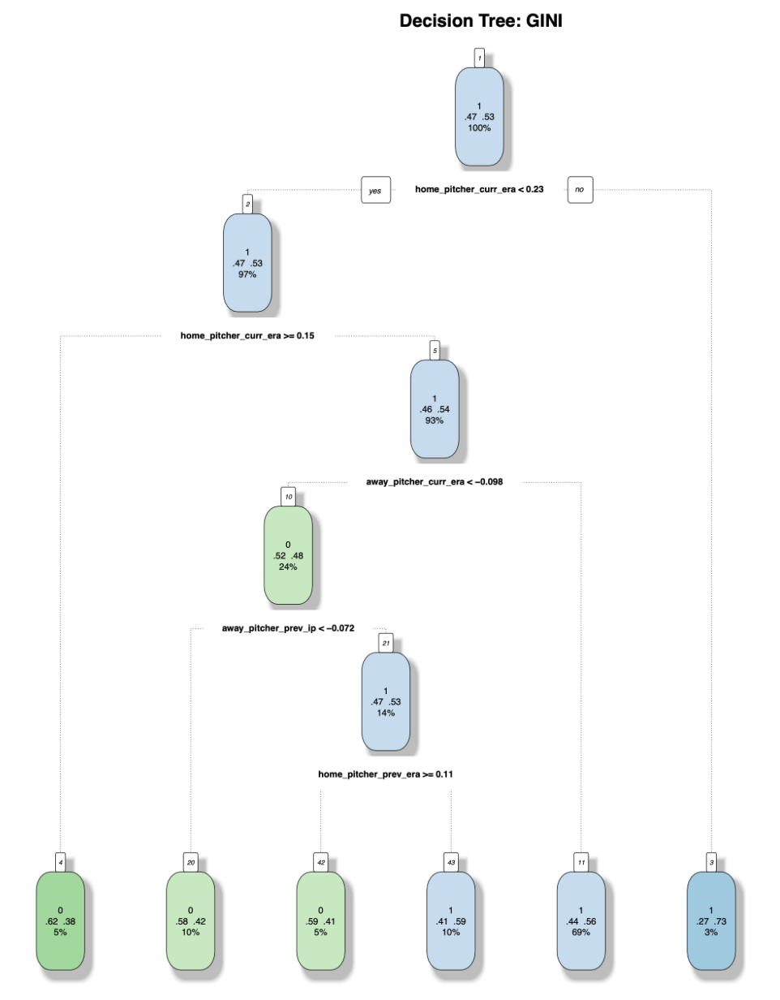
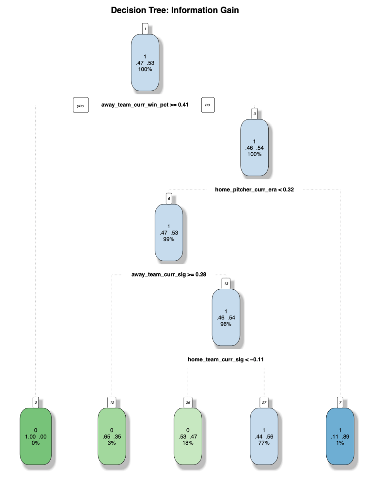

# Decision-Tree
Implemented Decision Tree algorithm using GINI Index and Information Gain to predict outcomes in R

## Instructions
To run `decisionTree.R`:
1. Ensure the packages identified in the install statements are available to the program.
2. Select decisionTree.R from the bookie/src/mfsapi directory and run the program.  The decisionTree.R file depends on three data files located in the bookie/src/mfsapi/data directory ("2017-regularPP.csv",  2018-regularPP.csv", and "2019-regularPP.csv") and is preconfigured to go there for the data.  That is all that is required to run the code.

Notes:
- This program performs Decision Tree for 2 scenarios using 2017 data for training and 2018 data for testing (Midway Results) 2017 and 2018 season data for training and 2019 season data for testing (Final Results).  
The 2 scenarios are:        
     1. Cross-Validation
     2. Without Cross-Validaion
- This code produces seperate decision tree outputs for 2 approaches. 
The 2 approaches are: 
     1. GINI Index and 
     2. Information Gain
     
## Results
`GINI Output:`

`Information Gain Output:`

